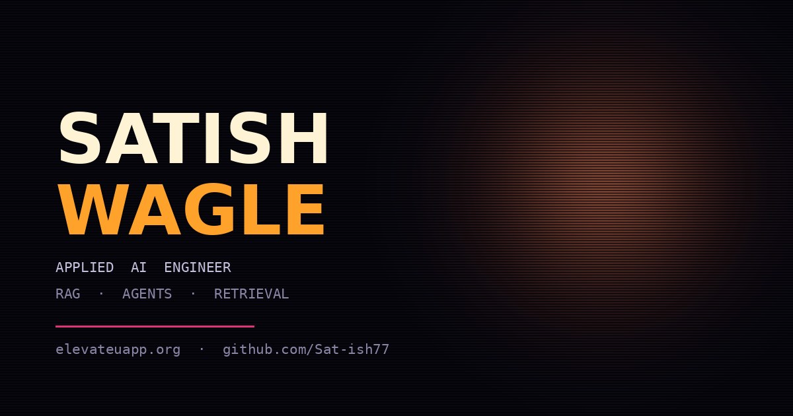

# Satish Wagle | Portfolio

An interactive portfolio presenting my work in AI, retrieval systems, backend engineering, voice interfaces, computer vision, and cloud data platforms.

[View the live portfolio](https://satishwagle.me)



## Highlights

- ORBIT, an interactive voice guide that introduces the portfolio
- Product X-Ray briefings for ElevateU and CrestMind AI
- Automatic project narration with pause, resume, and cancel controls
- Voice and typed portfolio questions
- Claude-powered answers grounded only in portfolio content
- Responsive layout with smooth animations
- Production FastAPI backend deployed on Google Cloud Run
- API credentials protected with Google Secret Manager

## Selected projects

### ElevateU

An AI-powered job search and study platform built for F-1 and OPT students.

ElevateU combines live job listings with more than 500,000 Department of Labor sponsorship records. It also includes résumé assistance, application preparation, assignment management, RAG tutoring, quizzes, and spaced flashcards.

[Open ElevateU](https://www.elevateuapp.org/)

Technologies: Python, LangGraph, FastAPI, pgvector, Playwright, Streamlit

### CrestMind AI

An industry-sponsored document intelligence platform for a real estate client.

CrestMind uses hybrid retrieval, LangGraph orchestration, Supabase, pgvector, Vertex AI, and citation-grounded generation to answer questions across leases, inspections, maintenance records, and property documents.

[View the repository](https://github.com/Sat-ish77/Crest-Mind-AI)

Technologies: LangGraph, FastAPI, pgvector, Vertex AI, Cloud Run, Next.js

### MediCall

An autonomous voice-agent assessment system that calls a medical receptionist AI and tests it for reliability, hallucinations, privacy risks, and unsafe behavior.

Technologies: Python, Twilio, ElevenLabs, GPT-4o

### Aviation Safety Analytics

A cloud data pipeline and analytics platform built from more than 38,000 aviation accident records.

Technologies: Azure Data Factory, Azure SQL, Power BI, Python

### HoloDesk

An experimental desktop agent controlled through hand tracking and voice.

Technologies: Python, OpenCV, MediaPipe, computer vision, voice interfaces

## Product X-Ray

Product X-Ray turns real product screenshots into guided engineering walkthroughs.

ORBIT automatically moves through numbered regions, highlights visible functionality, and explains the systems underneath each feature. Visitors can pause, resume, cancel, or manually explore the interface.

Product X-Ray is currently available for:

- ElevateU
- CrestMind AI

It does not require a camera or upload visitor data.

## ORBIT architecture

```text
Visitor
   |
   v
portfolio.html
   |
   +--> Scripted introduction and project tour
   |
   +--> Browser speech synthesis for free narration
   |
   +--> Static ElevenLabs opening audio
   |
   +--> Cloud Run FastAPI backend
             |
             +--> Request validation
             +--> Portfolio topic fence
             +--> Per-visitor rate limiting
             +--> Claude Sonnet
```

ORBIT answers only questions related to my portfolio, projects, skills, education, hiring fit, and contact information.

Claude-powered questions are limited to 10 per visitor per rolling 24-hour window. Scripted tours and Product X-Ray briefings do not consume this allowance.

## Run locally

### Frontend

From the repository root:

```bash
python -m http.server 8080
```

Open:

```text
http://localhost:8080/portfolio.html
```

Do not open `portfolio.html` directly with a `file://` address. Browser security restrictions can prevent ORBIT and the deployed backend from communicating correctly.

### Backend

The frontend already uses the deployed Cloud Run backend. Run the backend locally only when developing or testing backend changes.

```bash
cd backend
python -m venv .venv
```

Activate the environment:

```powershell
.venv\Scripts\Activate.ps1
```

Install dependencies:

```bash
pip install -r requirements.txt
```

Create the local environment file:

```powershell
Copy-Item .env.example .env
```

Add your Anthropic key to `backend/.env`:

```env
ANTHROPIC_API_KEY=your-key
ORBIT_MODEL=claude-sonnet-4-6
ALLOWED_ORIGINS=http://localhost:8080
```

Start the backend:

```bash
uvicorn main:app --reload --port 8000
```

Check its health:

```text
http://localhost:8000/health
```

To connect the frontend to the local backend temporarily, change `API_URL` inside `portfolio.html` to:

```javascript
const API_URL = "http://localhost:8000/api/orbit";
```

Never commit `backend/.env`.

## Voice setup

ORBIT's opening, guided tour, and Product X-Ray narration are pre-rendered
ElevenLabs MP3 files under `assets/orbit-*.mp3`. This keeps the voice consistent
on phones and laptops and does not make an ElevenLabs API request when somebody
visits.

To regenerate it, add these values to `backend/.env`:

```env
ELEVENLABS_API_KEY=your-key
ELEVENLABS_VOICE_ID=your-voice-id
```

Then run:

```bash
python backend/generate_intro_audio.py
```

Only free-form answers use the browser's free speech engine. Long responses are
split into sentence-sized chunks to avoid mobile Chrome's long-utterance stalls.

## Testing

Run the backend regression suite:

```bash
python backend/test_main.py
```

The tests use a mocked Anthropic response and do not spend API credits.

## Repository structure

```text
portfolio.html
assets/
  portrait.webp
  resume.pdf
  og.jpg
  orbit-intro.mp3
  elevateu-overview.png
  elevateu-jobs.png
  elevateu-study.png
  VOICE-README.md
backend/
  main.py
  test_main.py
  generate_intro_audio.py
  requirements.txt
  .env.example
  Dockerfile
```

## Deployment

### Frontend

The frontend is designed to deploy from the `main` branch through Vercel.

### Backend

The FastAPI backend runs on Google Cloud Run with:

- Scale-to-zero enabled
- One maximum instance
- Google Secret Manager for the Anthropic API key
- CORS restrictions
- Per-visitor rate limiting
- A whole-service request ceiling

Live API:

```text
https://portfolio-orbit-api-437466749679.us-central1.run.app
```

Health endpoint:

```text
https://portfolio-orbit-api-437466749679.us-central1.run.app/health
```

## Contact

- Email: [satish.wagle.cs@gmail.com](mailto:satish.wagle.cs@gmail.com)
- GitHub: [Sat-ish77](https://github.com/Sat-ish77)
- LinkedIn: [Satish Wagle](https://www.linkedin.com/in/satish-wagle/)

## License

This portfolio and its original design are personal work by Satish Wagle. Project source code may have separate licensing terms in its respective repository.
